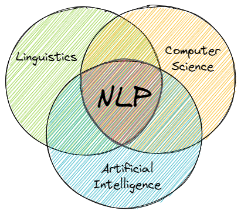

# NLP

NLP is a subfield of linguistics, computer science, and artificial intelligence, concerned with the interactions between computers and human language.

Or simply put - it is concerned with the question of how we can represent natural language in a way a computer can process it.

Information extraction, categorization, classification, or the general organization of documents are only a few of the tasks that can be solved by the application of Natural Language Processing.

We can roughly divide Natural Language Processing into two different kinds of approaches: \
    1. A pattern-based approach \
    2. A data-driven, machine-learning approach

The pattern-based approach is especially useful for search related tasks. The main idea here is to find and extract patterns (regular expression) or sequences of characters from a given text. Such patterns are then used to trigger scripted events or responses.

The second approach is more data-driven and relies on the application of machine learning and statistics to extract information, context, and deeper meaning from a given text. Examples are the application of Word-Vectors, RNNs in the form of LSTMs, and transformers-based neural network.
